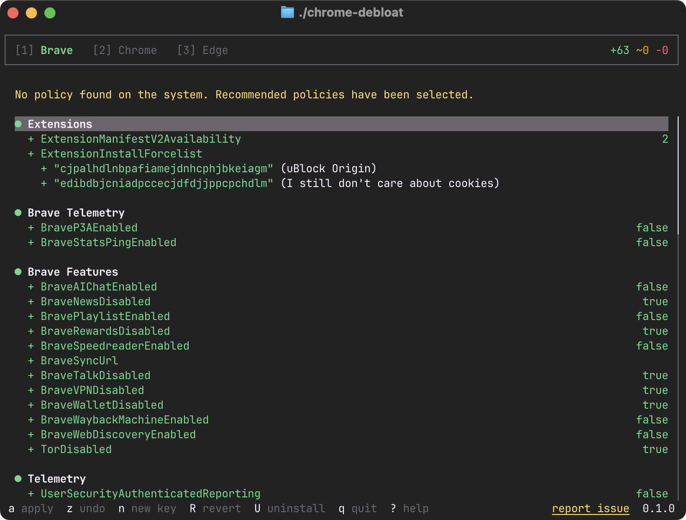
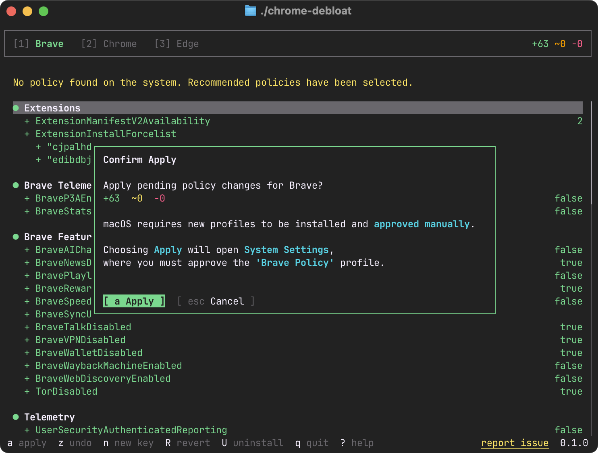
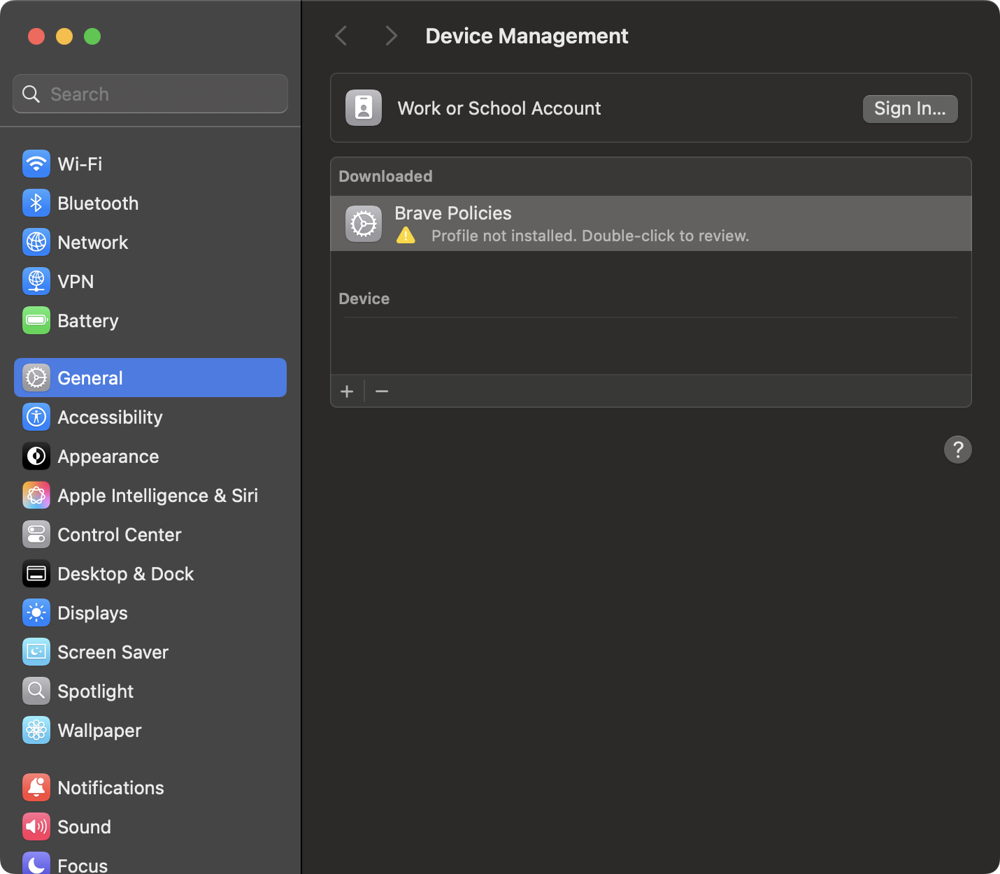
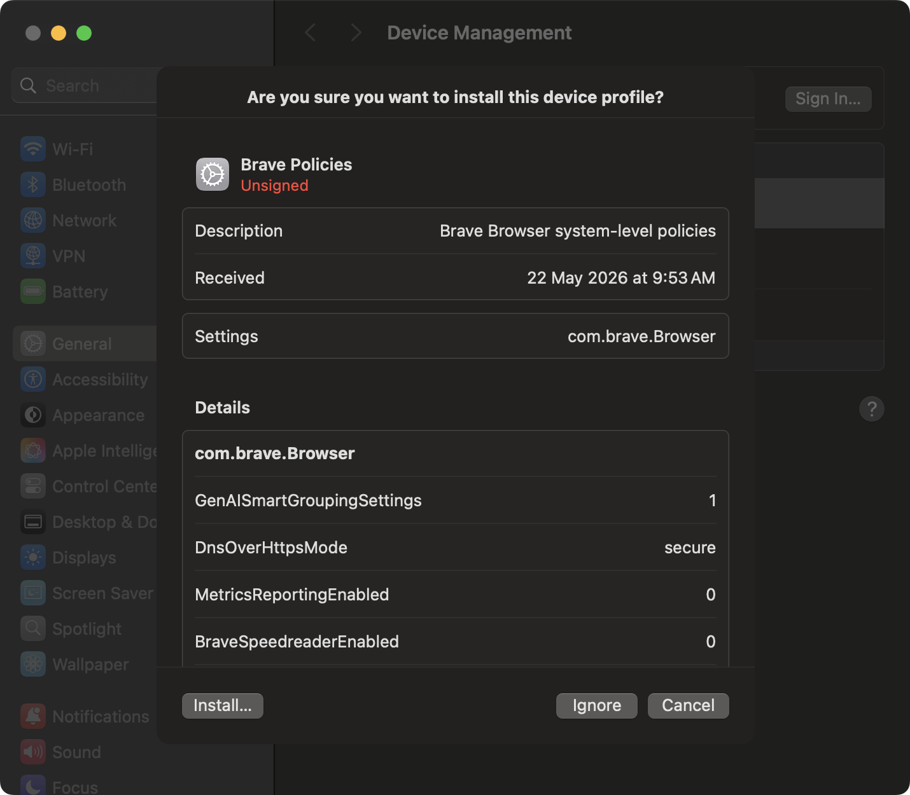
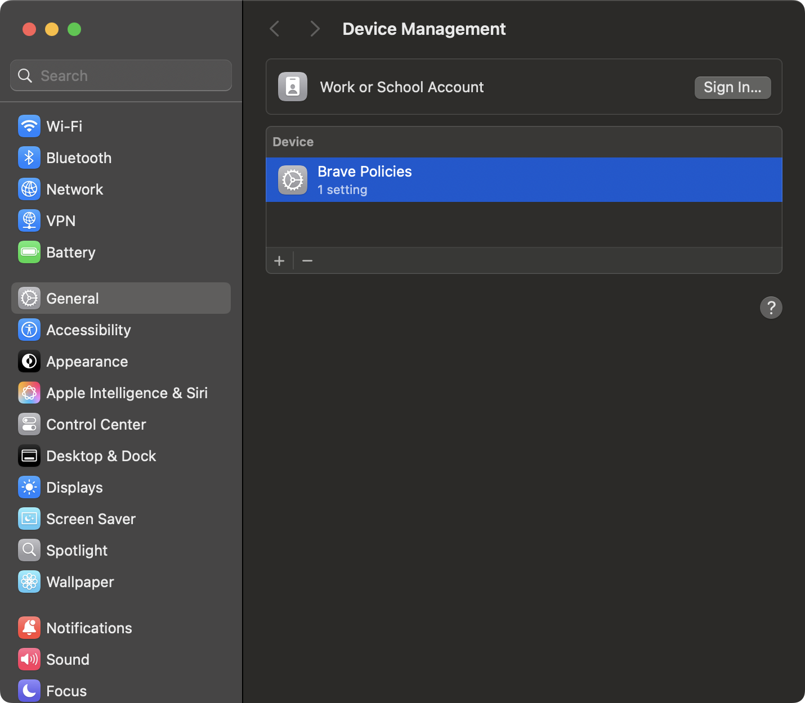
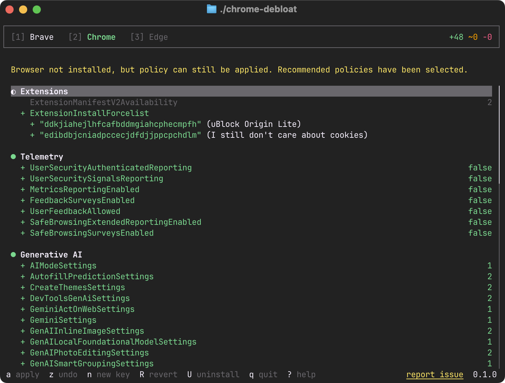
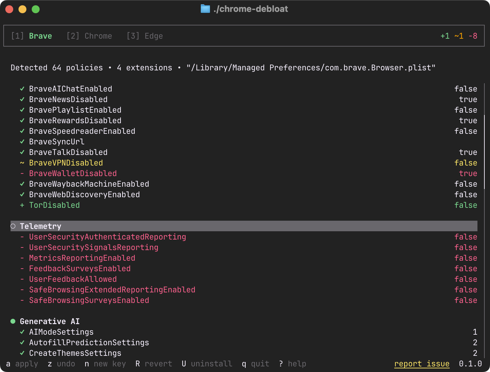
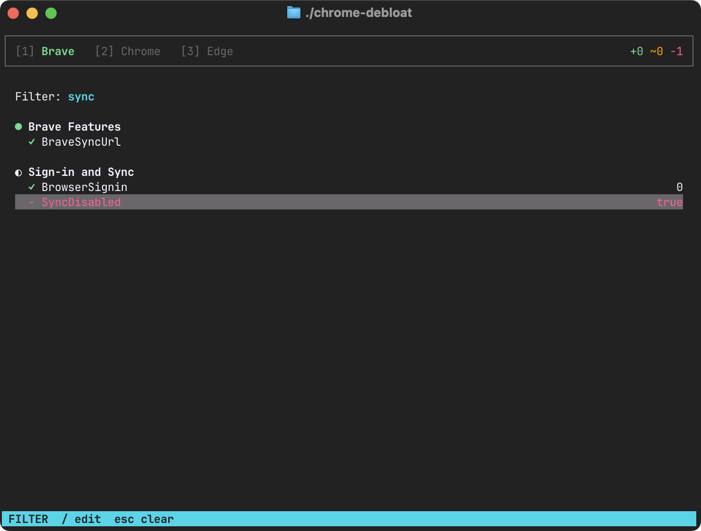
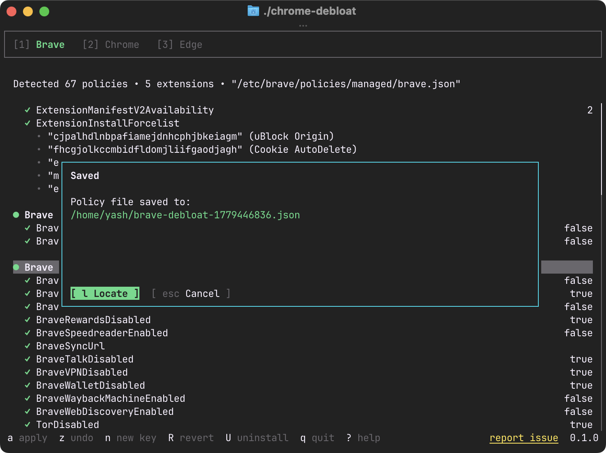
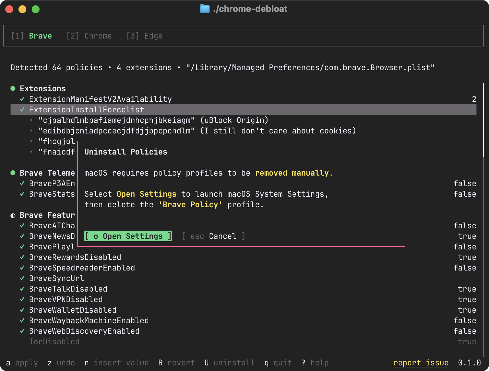

# Chrome Debloat

A TUI tool for automatically configuring and applying policies to Chromium-based browsers, ensuring a cleaner browsing experience.

Instantly disable telemetry, promotional clutter, and browser bloat while maintaining full usability. Includes a built-in editor for fine-tuning policies to your needs.

> [!WARNING]
> The old policy generation script is available in `legacy` branch, but it will not be maintained.

## Features

- Disable telemetry and usage reporting
- Disable GenAI features
- Disable bloatware, promotional features and suggested content
- Disable vendor specific Sign-In and Sync
- Tighten Site-Shield settings (disable location detection, notifications, etc)
- Install content-blocking extensions:
  - **Brave**
    - uBlock Origin
    - I still don't care about cookies
  - **Chrome**
    - uBlock Origin Lite
    - I still don't care about cookies
  - **Edge** (from edge addons store)
    - uBlock Origin
    - I still don't care about cookies
    - Blank Tab

## Supported Browsers

| Browser | Windows | macOS | Linux |
|---------|---------|-------|-------|
| Google Chrome | ✅ | ✅ | ✅ |
| Microsoft Edge | ✅ | ✅ | ✅ |
| Brave | ✅ | ✅ | ✅ |

## Quick Start

This tool does not require installation, and can be run in a single command.

### Linux / macOS

```sh
sh -c "$(curl -fsSL "https://debloat.yashg.dev/install.sh")"
```

### Windows
```sh
powershell -ExecutionPolicy Bypass -c "irm https://debloat.yashg.dev/install.sh | iex"
```

Or download the binary from the [latest GitHub release](https://github.com/NVFP4/chrome-debloat/releases/latest) and run it directly.

## Usage

On first launch, recommended profiles are pre-selected by default.

### Applying Profiles

Press `a` to apply these profiles directly for the current selected browser.




> [!WARNING]
> On Windows, the policy will be applied automatically.
> On Linux, the policy will be applied automatically, but app needs to run as `sudo`.
> On macOS, you will be prompted to install the profiles through System Settings.



Chrome debloat will automatically open System preferences



Double click to install the profile. This will show the review dialog. Press Install.



After entering your credentials, the policies will take effect.



### Choosing Browsers

You can press numbers `1`, `2`, `3` to select the browser from the tab for which policies will be applied.



**NOTE**: You can apply policies for browsers that are not available on the system.

### Customizing Policies

The recommended preset provides a solid baseline, but you can customize it to fit your needs. The configuration acts like an editor, allowing you to add, edit, or remove individual policies or entire policy groups.

Press `h` `l` or `←` `→` to jump policy groups.

Press `j` `k` or `↑` `↓` to navigate through the list.

Press `space` to toggle a policy item. Press it on a policy group to toggle all items within it.

Press `d` or `backspace` on a policy item or a group to mark them for deletion.

Press `enter` to edit the value of a policy item



Or you can use filters to quickly narrow down that policy item. 

Press `/` to show the filter input and type your query.
Press `Tab` to leave the input, and browse the results.



**Note**: Filter applies to current browser settings, but you can switch to other browsers and the ilte

If you've made changes that you don't want, you press `z` undo last edit, `r` to redo and `R` (`Shift+r`) to revert all changes.

### Exporting Policies

You can export the policies (including the edits) on your system without applying.

Press `S` (`Shift+s`) to save the policy



### Uninstalling Policies

If you want to delete all policies for the selected browser, press `U` (`Shift+u`).



> [!WARNING]
> This is destructive. So make sure you save a copy of your policies.

## Policy Documentation

- [Chrome Enterprise Policies](https://chromeenterprise.google/policies/)
- [Brave Policies](https://support.brave.com/hc/en-us/articles/360039248271-Group-Policy)
- [Microsoft Edge Policies](https://learn.microsoft.com/en-us/deployedge/microsoft-edge-policies)

## License

[Apache 2.0](./LICENSE)
